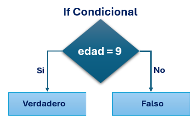
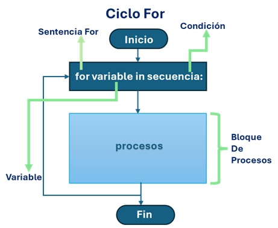
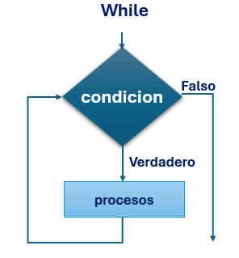
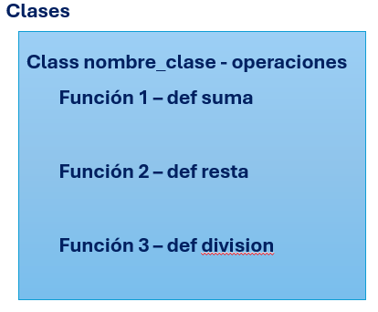
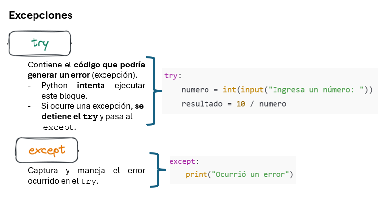

## 2.1 Delimitadores y PEPs

Python utiliza **indentación obligatoria** para delimitar bloques de código, lo que favorece la legibilidad y reduce errores estructurales.

Un bloque de código:
- Inicia con `:`
- Continúa con instrucciones indentadas (4 espacios recomendados)

Los **PEP (Python Enhancement Proposals)** son documentos oficiales que definen estándares del lenguaje.  
El más relevante para programación básica es **PEP 8**, que regula el estilo del código.

Principios clave de PEP 8:
- 4 espacios por nivel de indentación
- Nombres descriptivos en `snake_case`
- No mezclar tabuladores y espacios
- Separar bloques lógicos con líneas en blanco

## ¿Qué es el pep 8?
PEP8 Es una guía de codificación, la cual nos permite escribir código Python de una manera, mucho más legible y de forma consistente, a través de ciertas "reglas" y recomendaciones. 

## Ejemplo 

```python
edad = 20

if edad >= 18:
    print("Mayor de edad")
else:
    print("Menor de edad")
```

```python
numero = 15

if numero % 2 == 0:
    print("El número es par")
else:
    print("El número es impar")
```

## 2.2 Instrucciones y Construcciones Funcionales

Las estructuras de control permiten modificar el flujo de ejecución de un programa.

## Principales estructuras:

- Condicionales (if, elif, else)

- Ciclos (for, while)

## Condicional (if)




```python
calificacion = 7

if calificacion >= 6:
    print("Aprobado")
else:
    print("Reprobado")
```

## Ciclo for



```python
for i in range(1, 6):
    print(i)
```

## Ciclo while


```python
contador = 1
while contador <= 5:
    print(contador)
    contador += 1
```

## 2.3 Declaración de Variables, Funciones, Clases y Módulos

## Variables

En Python no es necesario indicar el tipo de dato

Python asigna el tipo de dato automáticamente en tiempo de ejecución.

```python
nombre = "Luis"
edad = 22
```

## Funciones

Permiten organizar y reutilizar código.

```python
def sumar(a, b):
    return a + b
```

## Clases

Permiten crear objetos con atributos y métodos.




```python
class Alumno:
    def __init__(self, nombre, promedio):
        self.nombre = nombre
        self.promedio = promedio

    def mostrar_datos(self):
        print(self.nombre, self.promedio)
```

## 2.4 Tipado Dinámico y Manejo de Excepciones

Python utiliza tipado dinámico, lo que significa que una variable puede cambiar de tipo durante la ejecución.

```python
x = 10
x = "Hola"
```

## Manejo de excepciones

Permite controlar errores y evitar que el programa se detenga.



```python
try:
    numero = int(input("Ingresa un número: "))
    resultado = 10 / numero
    print(resultado)
except ValueError:
    print("Error: entrada inválida")
```

