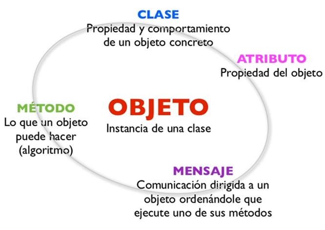

# Tema 3. Modelo de Objetos y Programación Orientada a Objetos en Python

## 3. MODELO DE OBJETOS Y PROGRAMACIÓN ORIENTADA A OBJETOS

La **Programación Orientada a Objetos (POO)** es un paradigma de programación que organiza el software en torno a **objetos**, los cuales combinan datos y comportamientos.  
Python es un lenguaje multiparadigma que ofrece un soporte completo para la POO.



---

## 3.1 Herramientas de la Programación Orientada a Objetos

### Objetos
Un **objeto** es una instancia de una clase (una plantilla), que encapsula datos (atributos) y comportamiento (métodos), permitiendo modelar entidades del mundo real, desde números y cadenas hasta estructuras más complejas, siendo un concepto fundamental de la Programación Orientada a Objetos (POO) donde todo es un objeto

Ejemplo:
- Clase: `Estudiante`
- Objeto: un estudiante específico

---

### Clases
Una **clase** es una colección de objetos de tipo similar. Una vez que se define una clase, cualquier objeto nuevo creado puede pertenecer a esa clase

```python
class Coche:
    pass
```

### Atributos
Son las variables que describen el estado del objeto.

```python
class Coche:
    def __init__(self, nombre, edad):
        self.color = color
        self.aceleracion = aceleracion
        self.velocidad = velocidad 
```

### 3.2 Funciones principales y primitivas asociadas

```python
__init__
```
Método constructor que inicializa el objeto.

```python
class Alumno:
    def __init__(self, nombre):
        self.nombre = nombre

```
### self

Hace referencia al objeto actual.

### type()

Devuelve el tipo de un objeto.

```python
print(type(Alumno("Ana")))

```

### dir()

Muestra los atributos y métodos disponibles.

```python
print(dir(Alumno("Ana")))

```

### 3.3 Clases, métodos, herencia y otros conceptos

### Clases y métodos

```python
class Estudiante:
    def __init__(self, nombre, carrera):
        self.nombre = nombre
        self.carrera = carrera

    def presentarse(self):
        print(f"Hola, soy {self.nombre} y estudio {self.carrera}")
```

```python
e1 = Estudiante("Juan", "Ingeniería")
e1.presentarse()
```

### Encapsulamiento

Encapsulación (o encapsulamiento), en programación orientada a objetos, hace referencia a la capacidad que tiene un objeto de ocultar su estado, de manera que sus datos solo se puedan modificar por medio de las operaciones (métodos) que ofrece.

La idea es proteger la información y evitar modificaciones incorrectas desde fuera del objeto.

### Problema SIN encapsulamiento (ejemplo incorrecto)

```python
class Cuenta:
    def __init__(self, saldo):
        self.saldo = saldo  # atributo público
```

### Uso

```python
cuenta = Cuenta(1000)

# Se puede modificar directamente (❌ mala práctica)
cuenta.saldo = -500

print(cuenta.saldo)
```
### Nota: El saldo puede quedar negativo sin ninguna validación.

### Solución CON encapsulamiento
#### Paso 1: Atributo privado
En Python, se hace privado anteponiendo __ al nombre del atributo.

```python
class CuentaBancaria:
    def __init__(self, saldo):
        self.__saldo = saldo  # atributo privado
```
Esto evita el acceso directo:

```python
cuenta.__saldo   # ❌ Error
```
#### Paso 2: Métodos para acceder y modificar

```python
class CuentaBancaria:
    def __init__(self, saldo):
        self.__saldo = saldo

    def mostrar_saldo(self):
        return self.__saldo

    def depositar(self, monto):
        if monto > 0:
            self.__saldo += monto

    def retirar(self, monto):
        if 0 < monto <= self.__saldo:
            self.__saldo -= monto
        else:
            print("Monto inválido")
```
### Uso correcto:
```python
cuenta = CuentaBancaria(1000)

cuenta.depositar(500)
cuenta.retirar(300)

print("Saldo final:", cuenta.mostrar_saldo())
```

```python
class CuentaBancaria:
    def __init__(self, saldo):
        self.__saldo = saldo

    def depositar(self, monto):
        if monto > 0:
            self.__saldo += monto

    def mostrar_saldo(self):
        print("Saldo:", self.__saldo)
```

### Herencia

Esto es, se pueden crear clases nuevas a partir de clases anteriormente creadas y aquellas pueden obtener los atributos, métodos, etc. de la clase de la que depende.

```python
class Persona:
    def __init__(self, nombre):
        self.nombre = nombre

    def saludar(self):
        print("Hola, soy", self.nombre)

```

```python
class Profesor(Persona):
    def __init__(self, nombre, materia):
        super().__init__(nombre)
        self.materia = materia

    def enseñar(self):
        print("Enseño", self.materia)
```

### Polimorfismo

Polimorfismo significa la capacidad de tomar más de una forma. Una operación puede presentar diferentes comportamientos en diferentes instancias. El comportamiento depende de los tipos de datos utilizados en la operación. El polimorfismo es ampliamente utilizado en la aplicación de la herencia.

```python
class Perro:
    def sonido(self):
        print("Guau")

class Gato:
    def sonido(self):
        print("Miau")

animales = [Perro(), Gato()]

for animal in animales:
    animal.sonido()

```
