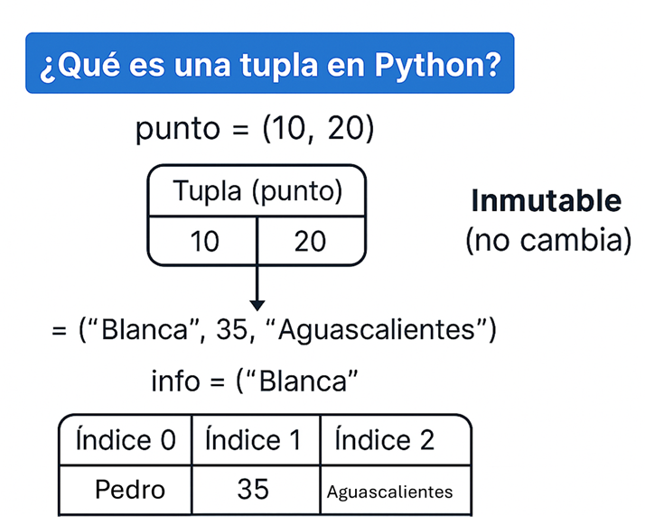

## Unidad 5. TIPOS DE DATOS Y ALGORITMOS APLICADOS II

### Fundamentación teórica

### 1. Tipos de Datos y Estructuras de Datos en Python
Python maneja datos básicos (primitivos) y estructuras de datos más complejas para organizar la información: 

### Tipos Numéricos:
> - **int:** Enteros de precisión arbitraria (ej. 10, 1000).
> - **float:** Números de punto flotante (decimales, ej. 3.14).
> - **complex:** Números complejos (ej. 1 + 2j).

### Texto y Lógicos:
> - **str:** Cadenas de caracteres (texto) encerradas entre comillas simples o dobles.
> - **bool:** Valores booleanos (True o False).

### Estructuras de Datos (Secuencias y Mapeos):
> - **Listas (list):** Secuencias ordenadas, mutables y heterogéneas. Son muy versátiles para añadir/eliminar elementos.
> - **Tuplas (tuple):** Secuencias inmutables (no se pueden cambiar tras crearse). Usadas para datos que no deben modificarse.
> - **Diccionarios (dict):** Colecciones de pares clave-valor. Son extremadamente rápidos para búsquedas.
> - **Conjuntos (set):** Colecciones desordenadas de elementos únicos (sin duplicados). 

El objetivo ahora es emplear estas estructuras de datos de manera avanzada, combinándolas para resolver problemas algorítmicos más complejos.

Desde el punto de vista algorítmico, estas estructuras permiten:

- Optimizar recorridos y búsquedas  
- Reducir complejidad computacional  
- Representar datos del mundo real de forma estructurada  
- Aplicar filtros, transformaciones y validaciones  

El uso avanzado implica **pensar en términos de datos**, no solo en instrucciones.

### 5.1 Uso avanzado de listas, conjuntos, cadenas y diccionarios

### Ejemplo 1: Filtrado avanzado con listas y diccionarios

```python
estudiantes = [
    {"nombre": "Ana", "promedio": 85},
    {"nombre": "Luis", "promedio": 68},
    {"nombre": "María", "promedio": 92}
]

aprobados = [
    e["nombre"]
    for e in estudiantes
    if e["promedio"] >= 70
]

print(aprobados)
```
#### 🧮 **Salida** ####

- ['Ana', 'María']

### Ejemplo 2: Eliminación eficiente de duplicados usando conjuntos
```python
correos = ["a@mail.com", "b@mail.com", "a@mail.com", "c@mail.com"]
correos_unicos = list(set(correos))
print(correos_unicos)
```
Donde:

> - **set()** crea un conjunto, y los conjuntos no permiten elementos repetidos.
> - **list()** convierte ese conjunto nuevamente en una lista.

#### 🧮 **Salida** ####
- ['c@mail.com', 'a@mail.com', 'b@mail.com']

### 5.2 Operaciones y métodos específicos
Los métodos propios de cada tipo de dato permiten realizar operaciones optimizadas y seguras. Su correcto uso evita estructuras de control innecesarias y mejora la legibilidad del código.

### Cadenas (str)
- **upper()** → Convierte a mayúsculas
- **lower()** → Minúsculas
- **strip()** → Quita espacios
- **replace(a, b)** → Reemplaza
- **split()** → Divide por separador
- **startswith()** / endswith()
- **find()** → Busca y devuelve posición

```python
texto = "   Hola Mundo desde Python   "
print("Cadena original:", repr(texto))

print("upper():", texto.upper())
print("lower():", texto.lower())
print("strip():", repr(texto.strip()))
print("replace('Mundo','Universo'):", texto.replace("Mundo", "Universo"))
print("split():", texto.split())
print("startswith('Hola'):", texto.strip().startswith("Hola"))
print("endswith('Python'):", texto.strip().endswith("Python"))
print("find('Mundo'):", texto.find("Mundo"))
```

#### 🧮 **Salida** ####

> - Cadena original: '   Hola Mundo desde Python   '
> - upper():    HOLA MUNDO DESDE PYTHON   
> - lower():    hola mundo desde python   
> - strip(): 'Hola Mundo desde Python'
> - replace('Mundo','Universo'):    Hola Universo desde Python   
> - split(): ['Hola', 'Mundo', 'desde', 'Python']
> - startswith('Hola'): True
> - endswith('Python'): True
> - find('Mundo'): 8


### Listas (list)
- **append(x)** → Añade un elemento
- **extend(iterable)** → Añade varios
- **insert(i, x)** → Inserta en posición
- **pop()** → Quita y devuelve
- **remove(x)** → Elimina por valor
- **sort()** → Ordena
- **reverse()** → Invierte

```python
# Lista base
numeros = [3, 1, 4]
print("Inicial:", numeros)

# 1) append(x) → Añade un elemento al final
numeros.append(9)
print("Después de append(9):", numeros)

# 2) extend(iterable) → Añade varios elementos (iterable)
numeros.extend([2, 6, 5])
print("Después de extend([2, 6, 5]):", numeros)

# 3) insert(i, x) → Inserta en una posición concreta
numeros.insert(2, 7)   # Inserta 7 en índice 2
print("Después de insert(2, 7):", numeros)

# 4) pop() → Quita y devuelve el último elemento (o por índice)
ultimo = numeros.pop()
print("pop() devuelve:", ultimo)
print("Lista tras pop():", numeros)

# También podemos quitar por índice específico
tercero = numeros.pop(2)   # quita el elemento en índice 2
print("pop(2) devuelve:", tercero)
print("Lista tras pop(2):", numeros)

# 5) remove(x) → Elimina la primera aparición del valor x
numeros.remove(1)  # si no existe, lanza ValueError
print("Después de remove(1):", numeros)

# 6) sort() → Ordena la lista (in-place). Por defecto ascendente.
numeros.sort()
print("Después de sort() ascendente:", numeros)

# sort() con reverse=True para descendente
numeros.sort(reverse=True)
print("Después de sort(reverse=True) descendente:", numeros)

# sort() con key para ordenar por criterio (ejemplo: valor absoluto)
mixtos = [3, -10, 2, -5, 0]
mixtos.sort(key=abs)
print("Ordenado por valor absoluto (key=abs):", mixtos)

# 7) reverse() → Invierte el orden actual (no ordena, solo invierte)
numeros.reverse()
print("Después de reverse():", numeros)

```

#### 🧮 **Salida** ####

> - Inicial: [3, 1, 4]
> - Después de append(9): [3, 1, 4, 9]
> - Después de extend([2, 6, 5]): [3, 1, 4, 9, 2, 6, 5]
> - Después de insert(2, 7): [3, 1, 7, 4, 9, 2, 6, 5]
> - pop() devuelve: 5
> - Lista tras pop(): [3, 1, 7, 4, 9, 2, 6]
> - pop(2) devuelve: 7
> - Lista tras pop(2): [3, 1, 4, 9, 2, 6]
> - Después de remove(1): [3, 4, 9, 2, 6]
> - Después de sort() ascendente: [2, 3, 4, 6, 9]
> - Después de sort(reverse=True) descendente: [9, 6, 4, 3, 2]
> - Ordenado por valor absoluto (key=abs): [0, 2, 3, -5, -10]
> - Después de reverse(): [2, 3, 4, 6, 9]

### Tuplas (tuple)
Las tuplas son inmutables, por lo que sus métodos son muy limitados.
- **count(x)** → Cuenta ocurrencias
- **index(x)** → Devuelve la posición



### Ejemplo 1: Analizar datos y localizar posiciones con rangos (index con start/stop) + count
Escenario: Tenemos un registro de códigos de estado en una tupla y queremos:

- Contar cuántas veces aparece un código específico.
- Encontrar la primera posición donde aparece en un rango (sin revisar toda la tupla).
- Iterar para encontrar todas las posiciones donde aparece.

```python
estados = ("OK", "ERR", "PEND", "OK", "OK", "ERR", "PEND", "OK", "ERR", "OK")

# 1) Contar ocurrencias
num_ok = estados.count("OK")
num_err = estados.count("ERR")
print("count('OK'):", num_ok)    # 5
print("count('ERR'):", num_err)  # 3

# 2) Buscar la primera aparición de 'ERR' entre índices 2 y 8 (stop es exclusivo)
pos_err_parcial = estados.index("ERR", 2, 9)
print("index('ERR', 2, 9):", pos_err_parcial)  # 5

# 3) Encontrar todas las posiciones de 'OK' recorriendo con saltos de index
objetivo = "OK"
posiciones = []
inicio = 0

try:
    while True:
        i = estados.index(objetivo, inicio)
        posiciones.append(i)
        inicio = i + 1
except ValueError:
    pass  # No hay más coincidencias

print("Todas las posiciones de 'OK':", posiciones)  # [0, 3, 4, 7, 9]
```
#### 🧮 **Salida** ####
> - count('OK'): 5
> - count('ERR'): 3
> - index('ERR', 2, 9): 5
> - Todas las posiciones de 'OK': [0, 3, 4, 7, 9]

### Ejemplo 2: Normalización de datos + validación robusta con index y count

Tenemos una tupla con categorías (posibles repeticiones y variaciones de mayúsculas). Queremos:

Normalizar a mayúsculas.
Verificar que una categoría objetivo existe (si no, dar un mensaje claro).
Si existe, reportar cuántas veces aparece y todas sus posiciones.

```python
categorias = ("ventas", "Compras", "VENTAS", "Logística", "compras", "VENTAS", "calidad")

# 1) Normalizamos a mayúsculas para análisis consistente
normalizadas = tuple(cat.upper() for cat in categorias)
print("Normalizadas:", normalizadas)
# ('VENTAS', 'COMPRAS', 'VENTAS', 'LOGÍSTICA', 'COMPRAS', 'VENTAS', 'CALIDAD')

objetivo = "VENTAS"

# 2) Validación de existencia con count
apariciones = normalizadas.count(objetivo)
if apariciones == 0:
    print(f"La categoría '{objetivo}' no está presente.")
else:
    print(f"'{objetivo}' aparece {apariciones} veces.")

    # 3) Ubicar posiciones de forma segura con index y manejo de errores
    posiciones = []
    inicio = 0
    try:
        while True:
            i = normalizadas.index(objetivo, inicio)
            posiciones.append(i)
            inicio = i + 1
    except ValueError:
        pass

    print(f"Posiciones de '{objetivo}':", posiciones)
```
#### 🧮 **Salida** ####
> - Normalizadas: ('VENTAS', 'COMPRAS', 'VENTAS', 'LOGÍSTICA', 'COMPRAS', 'VENTAS', 'CALIDAD')
> - 'VENTAS' aparece 3 veces.
> - Posiciones de 'VENTAS': [0, 2, 5]

### Diccionarios (dict)
Los diccionarios administran información en pares clave–valor.
- **keys()** → Claves
- **values()** → Valores
- **items()** → Pares clave-valor
- **get(clave, defecto)** → Acceso seguro
- **update(otro_dict)** → Mezcla
- **pop(clave)** → Quita y devuelve un elemento
- **clear()** → Limpia el diccionario


### Ejemplo 1: Ordenamiento avanzado con criterio personalizado


```python
productos = [
{"nombre": "Laptop", "precio": 15000},
{"nombre": "Mouse", "precio": 300},
{"nombre": "Monitor", "precio": 4000}
]

productos.sort(key=lambda p: p["precio"], reverse=True)
print(productos)
```
#### 🧮 **Salida** ####
- [{'nombre': 'Laptop', 'precio': 15000}, {'nombre': 'Monitor', 'precio': 4000}, {'nombre': 'Mouse', 'precio': 300}]

### Ejemplo 2: Uso seguro de diccionarios con get()

```python
config = {"tema": "oscuro", "idioma": "es"}

idioma = config.get("idioma", "no definido")
region = config.get("region", "MX")
print(idioma, region)
```

#### 🧮 **Salida** ####
- es MX

### 5.3 Gestión de fechas y horarios

La gestión temporal es esencial en sistemas informáticos reales como plataformas educativas, sistemas de control, auditorías y análisis longitudinales.

El manejo avanzado de fechas implica:

- Comparación de fechas
- Validación de periodos
- Cálculo de duraciones
- Control de eventos y vencimientos

Python proporciona el módulo datetime, que permite tratar el tiempo como una entidad manipulable y comparable.

### Ejemplo 1: Validación de fechas de entrega

```python
from datetime import datetime
fecha_entrega = datetime(2026, 2, 1)
hoy = datetime.now()

if hoy <= fecha_entrega:
    print("Entrega en tiempo")
else:
    print("Entrega fuera de tiempo")
```

#### 🧮 **Salida** ####
- Entrega fuera de tiempo

### Ejemplo 2: Cálculo de duración entre eventos

```python
from datetime import datetime

inicio = datetime(2026, 1, 1, 8, 0)
fin = datetime(2026, 1, 1, 12, 30)

duracion = fin - inicio
print("Horas:", duracion.total_seconds() / 3600)
```
#### 🧮 **Salida** ####
- Horas: 4.5

### 5.4 Evaluación booleana y operaciones de conjunto

La lógica booleana es la base de la toma de decisiones en programación. En esta etapa se emplea de forma compuesta para construir reglas de negocio, validaciones complejas y filtros de datos.

Las operaciones de conjunto permiten evaluar relaciones entre colecciones completas, lo cual es más eficiente que evaluar elemento por elemento.

### Ejemplo 1: Validación lógica compuesta

```python
usuario = "admin"
password = "1234"
activo = True

acceso = (usuario == "admin") and (password == "1234") and activo
print("Acceso permitido" if acceso else "Acceso denegado")
```
#### 🧮 **Salida** ####
- Acceso permitido

### Ejemplo 2: Operaciones de conjunto aplicadas a reglas
```python
usuarios_registrados = {"Ana", "Luis", "María"}
usuarios_con_pago = {"Ana", "María"}

usuarios_validos = usuarios_registrados & usuarios_con_pago
print(usuarios_validos)
```
#### 🧮 **Salida** ####
- {'Ana', 'María'}


